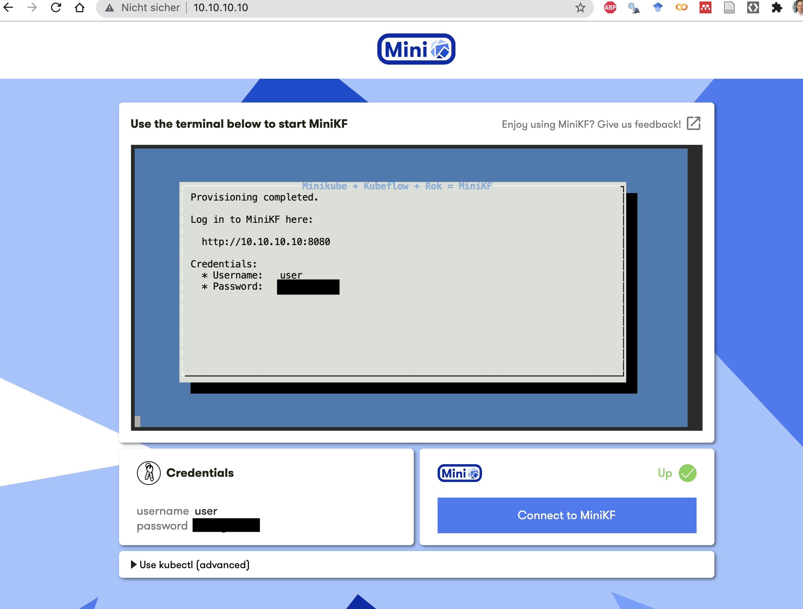
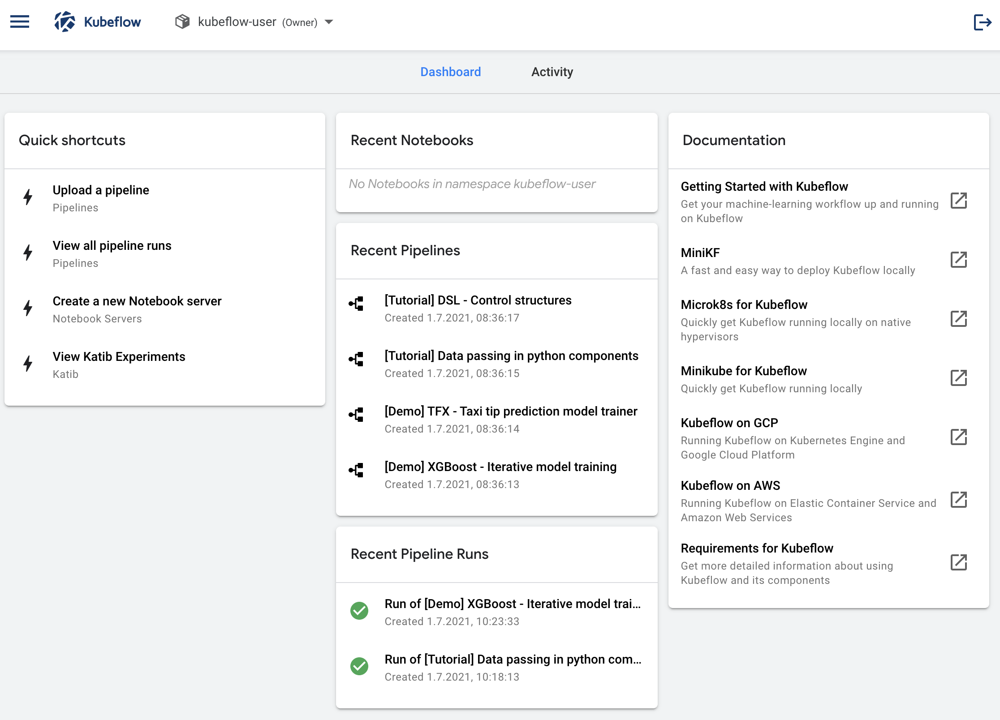

author: Jan Kirenz
summary: A fast and easy way to deploy Kubeflow on your laptop
id: kubeflow-install
tags: kubeflow
categories: mlops
environments: Web
status: Published
feedback link: https://github.com/kirenz/codelabs/blob/master/markdown/kubeflow-install

# Kubeflow Installation Tutorial

<!-- ------------------------ -->
## What you'll learn

Duration: 0:02:00

In this tutorial you learn how to install Kubeflow on your local machine. In particular, we use Mini Kubeflow[(MiniKF)](https://www.kubeflow.org/docs/distributions/minikf/minikf-vagrant/) which is based on the local Kubernetes distribution  minikube.

<aside class="positive">
 MiniKF is a single-node instance of Kubeflow, Kale, and Rok Data Management. It builds ML models for free on your laptop with Vagrant. However, it is possible to move to serving at scale with the same code on GCP, AWS, or Azure.
</aside>

<!-- ------------------------ -->
## Technology overview

Duration: 0:10:00

### Kubeflow


The Kubeflow project is dedicated to making deployments of machine learning (ML) workflows on Kubernetes simple, portable and scalable. It's goal is not to recreate other services, but to provide a straightforward way to deploy best-of-breed open-source systems for ML to diverse infrastructures. Anywhere you are running Kubernetes, you should be able to run Kubeflow.

To learn more:

- 📺 watch this short introduction to Kubeflow [video](https://www.youtube.com/watch?v=cTZArDgbIWw)
- 📖 review the [Kubeflow documentation](https://www.kubeflow.org/docs/about/kubeflow/)  

### MiniKF

MiniKF is the easiest way to get started with Kubeflow and comes bundled with [Kale](https://github.com/kubeflow-kale/kale) for automating MLOps workflow and [Rok](https://www.arrikto.com/rok-data-management-platform/) for ML data management.

With MiniKF, you can start building models in your Jupyter notebook and run them easily in Kubeflow Pipelines. When you’re ready to go into production, you can move to a multi-node Kubeflow cloud deployment on GCP, AWS, or Azure with one click. No extra coding or knowledge of containers needed (see Kubernetes).

A MiniKF (Mini Kubeflow) VM on GCP that automatically installs:

- Kubernetes (using Minikube)
- Kubeflow
- Kale, a tool to convert general purpose Jupyter Notebooks to Kubeflow Pipelines workflows (GitHub)
- Arrikto Rok data management platform for data versioning and reproducibility

To learn more:

- 📖 review the [Kubeflow MiniKF documentation](https://www.kubeflow.org/docs/distributions/minikf/)  

### Kubernetes


[Kubernetes](https://kubernetes.io/) (also known as K8s or "kube") is an open-source system for automating deployment, scaling, and management of containerized applications. A container is a standard unit of software that packages up code and all its dependencies so the application runs quickly and reliably from one computing environment to another.


For example, [Docker](https://www.docker.com/) can be used as a container runtime that Kubernetes orchestrates. A Docker container image is a lightweight, standalone, executable package of software that includes everything needed to run an application: code, runtime, system tools, system libraries and settings. Kubernetes groups containers that make up an application into logical units for easy management and discovery. In other words, you can cluster together groups of hosts running containers, and Kubernetes helps you easily and efficiently manage those clusters. 

Kubernetes builds upon 15 years of experience of running production workloads at Google, combined with best-of-breed ideas and practices from the community. It has become the standard orchestration platform for containers. All the major cloud providers support it, making it the logical choice for organizations looking to move more applications to the cloud.

To learn more:

- 📖 review the [Kubernetes documentation](https://kubernetes.io/docs/concepts/overview/what-is-kubernetes/)

### minikube


minikube is local Kubernetes (on macOS, Linux, and Windows), focusing on making it easy to learn and develop for Kubernetes. You just need a container or virtual machine manager, such as: Docker, Hyperkit, Hyper-V, KVM, Parallels, Podman, VirtualBox, or VMWare. In our tutorial, we will use Oracle's VirtualBox.

To learn more:

- 📖 review the [minikube documentation](https://minikube.sigs.k8s.io/docs/start/)

### VirtualBox

Oracle VM VirtualBox is a cross-platform virtualization application. It extends the capabilities of your existing computer so that it can run multiple OSes, inside multiple virtual machines, at the same time. As an example, you can run Windows and Linux on your Mac, run Windows Server on your Linux server, run Linux on your Windows PC, and so on, all alongside your existing applications. You can install and run as many virtual machines as you like. 

To learn more:

- 📖 review the [documentation](https://www.virtualbox.org/manual/ch01.html)

### Vagrant

Vagrant is a tool for building and managing virtual machine environments in a single workflow. With an easy-to-use workflow and focus on automation, Vagrant lowers development environment setup time and increases production parity.

To learn more:

- 📖 review the [Vagrant documentation](https://www.vagrantup.com/docs)

<!-- ------------------------ -->
## System requirements

Duration: 0:01:00

Ideally, your system should meet the following requirements:

- 12GB RAM
- 2 CPUs
- 50GB disk space

MiniKF runs on:

- Linux
- macOS
- Windows

<!-- ------------------------ -->
## Software prerequisites

Duration: 0:10:00

Before installing MiniKF, you need to have Vagrant and VirtualBox installed on your laptop:

- [Install Vagrant](https://www.vagrantup.com/downloads)  
- [Download VirtualBox](https://www.virtualbox.org/wiki/Downloads)

If you have **macOS**:  

- After the installation, you need to [change Security & Privacy General preferences on Mac](https://support.apple.com/de-de/guide/mac-help/mh11784/mac) to unblock VirtualBox:

  - To change these preferences on your Mac, choose Apple menu  > System Preferences, click Security & Privacy, then click General.
  - 🔒 If the lock at the bottom left of the pane is locked, click it to unlock the preference pane.
  - Allow to load system extensions.

<!-- ------------------------ -->
## MiniKF installation

Duration: 0:20:00

1. Open a terminal on your laptop and create a new directory:

```bash
mkdir minikf
```

2. Switch into it:

```bash
cd minikf
```

3. Run the following command to install MiniKF:

```bash
vagrant init arrikto/minikf
```

4. This command creates and configures your virtual machine:

```bash
vagrant up
```

- MiniKF will take a few minutes to boot.  

5. When this is done, open a browser and navigate to [http://10.10.10.10](http://10.10.10.10).  
  
6. Follow the on-screen instructions (press Enter on your keyboard to start the installation)

7. When installation is done, copy the provided username and password



8. Click on "Connect to MiniKF" and enter the username and password

- This will open the Kubeflow dashboard:



<aside class="negative">
If you run into problems, view this <a href="https://www.youtube.com/watch?v=rVak_NIKF88">video-tutorial</a> of the complete installation process
</aside>

<!-- ------------------------ -->
## Start MiniKF

Duration: 0:10:00

After installation, you can start MiniKf as follows:

- Open a terminal on your laptop and switch to your MiniKF directory (minikf):

```bash
cd minikf
```

- Run the following command to start MiniKF:

```bash
vagrant up
```

- Continue with steps 5-8 from the "MiniKF installation" explanations.  

<!-- ------------------------ -->
## What we've covered

Duration: 0:02:00

Gongratulations! You have completed the tutorial and learned how to:

✅ Install MiniKF on your computer.
✅ You are now ready to use Kubeflow on your local machine.


Thank you for participating in this tutorial. If you found any issues along the way I'd appreciate it if you'd raise them by clicking the "Report a mistake" button at the bottom left of this site.

*Copyright: Jan Kirenz (2021) | [kirenz.com](https://www.kirenz.com) | [CC BY-NC 2.0 License](https://creativecommons.org/licenses/by-nc/2.0/)*